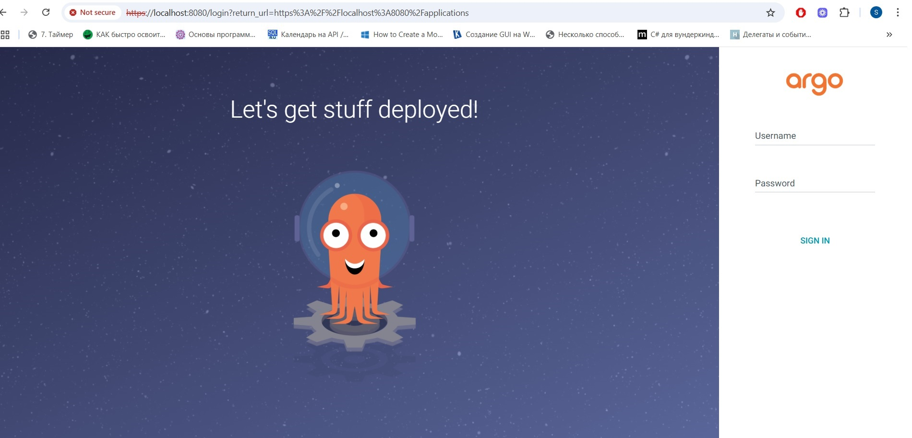
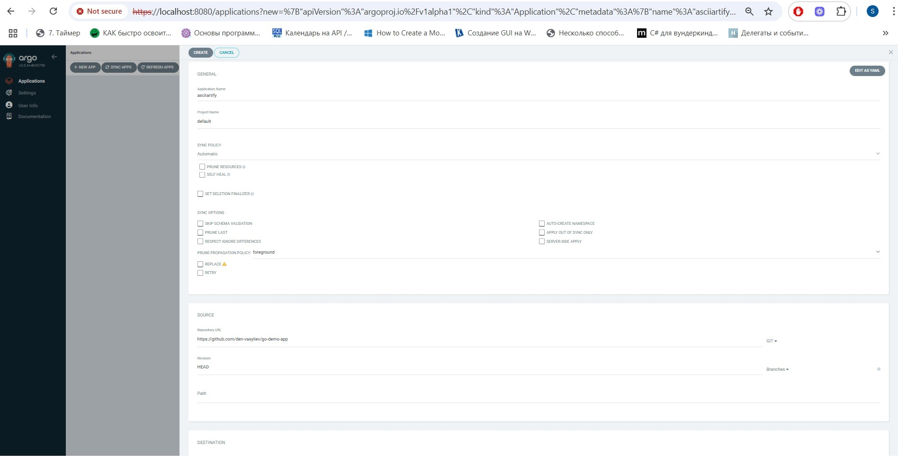
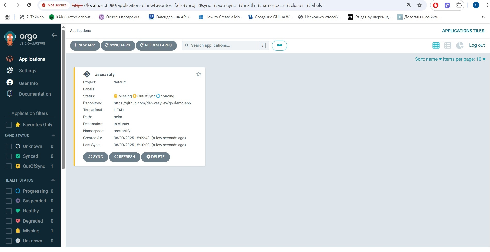
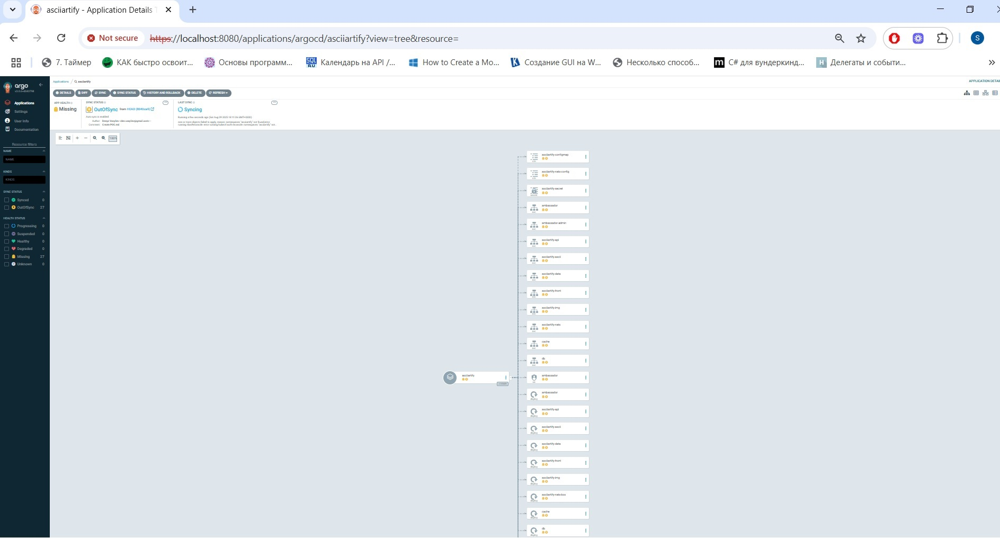

# MVP Deployment: AsciiArtify

## 🎯 Мета

На етапі MVP команда AsciiArtify перевіряє працездатність продукту на фокус-групі користувачів. Основна задача — автоматичне розгортання додатку з Git-репозиторію за допомогою GitOps-підходу.

## ⚙️ Інфраструктура

- Kubernetes кластер: локальний кластер, створений за допомогою Kind
- GitOps система: ArgoCD
- Репозиторій додатку: [go-demo-app](https://github.com/den-vasyliev/go-demo-app)
- Додаток розгорнуто через Helm chart у namespace `asciiartify`

## 🚀 Налаштування ArgoCD

1. Встановлено ArgoCD у кластер:
   
   kubectl create namespace argocd
   kubectl apply -n argocd -f https://raw.githubusercontent.com/argoproj/argo-cd/stable/manifests/install.yaml
   
2. Налаштовано доступ до GUI через портфорвардинг:

kubectl port-forward svc/argocd-server -n argocd 8080:443

3. Отримано пароль для входу:

kubectl get secret argocd-initial-admin-secret -n argocd -o jsonpath="{.data.password}" | base64 --decode

4. Створено додаток asciiartify в ArgoCD:

- **Source**: Git репозиторій go-demo-app, шлях helm

- **Destination**: локальний кластер, namespace asciiartify

- **Sync Policy**: автоматична синхронізація

Увімкнено створення namespace

## 🔄 Автоматична синхронізація
- ArgoCD автоматично відстежує зміни в репозиторії

- При зміні Helm-чарту (наприклад, тип сервісу або версія додатку), ArgoCD синхронізує стан у кластері

- Додаток оновлюється без ручного втручання

## 🖼️ Демонстрація роботи
У папці images/ репозиторію розміщено скріншоти, що демонструють роботу додатку в ArgoCD:

*Загальний вигляд додатку в ArgoCD*

*Статус синхронізації*

*Структура Helm-чарту*

*Підтвердження успішного розгортання*

Ці скріншоти демонструють, як ArgoCD автоматично синхронізує додаток з Git-репозиторієм та підтримує його актуальний стан у кластері.

## ✅ Результат
Додаток go-demo-app успішно розгорнуто через ArgoCD

Автоматична синхронізація працює стабільно

Інфраструктура готова до тестування MVP на фокус-групі